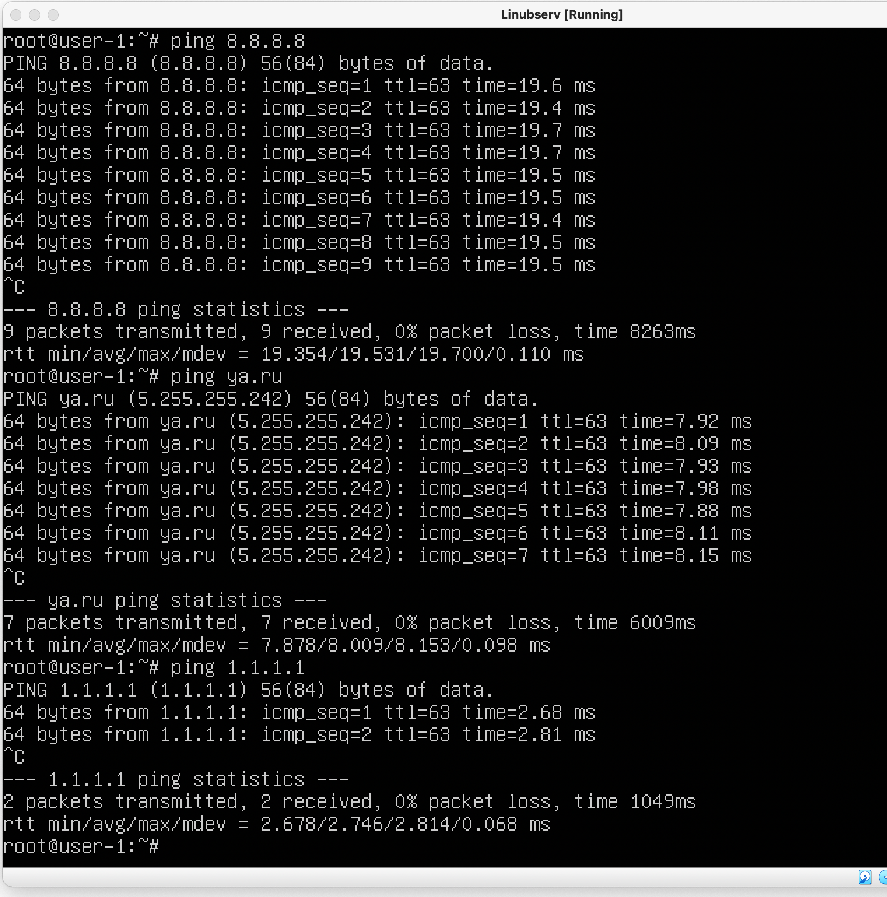
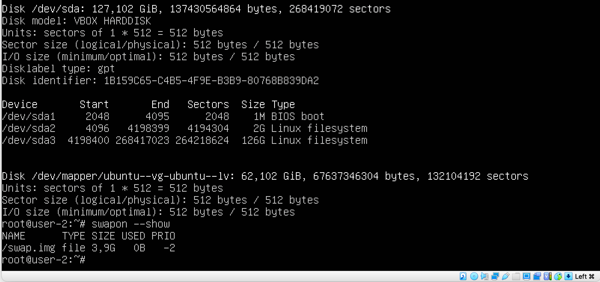
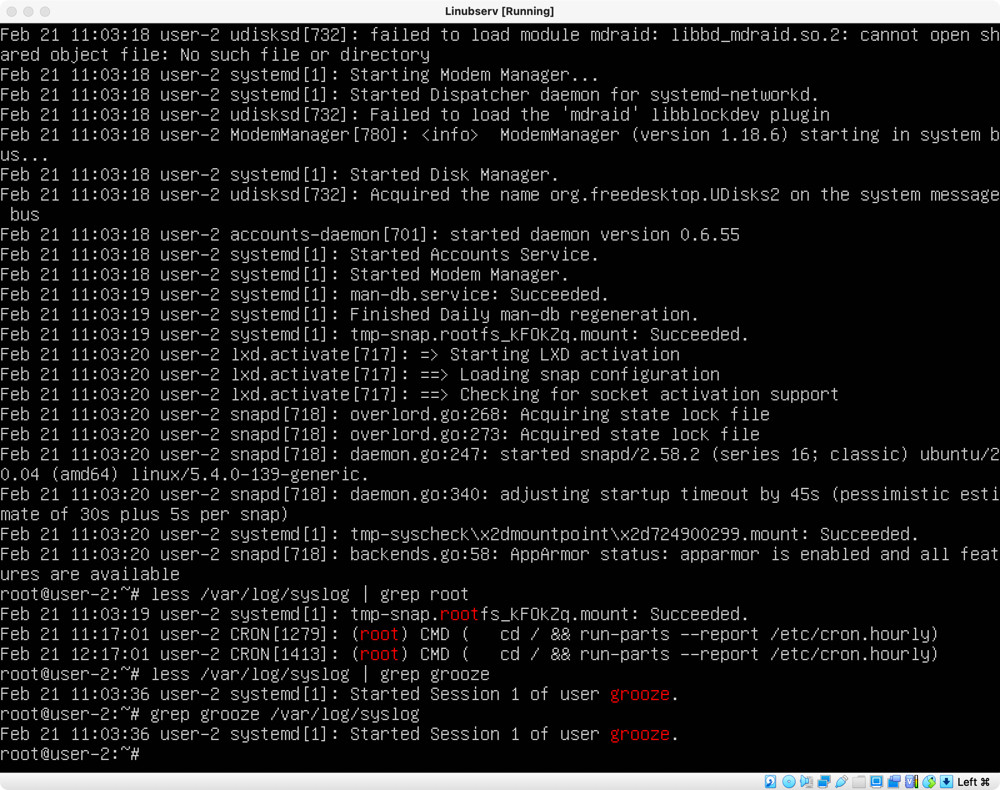

# Операционные системы UNIX/Linux (Базовый).

## Part 1. Установка ОС

##### Установить **Ubuntu 20.04 Server LTS** без графического интерфейса. (Используем программу для виртуализации - VirtualBox)
- Графический интерфейс должен отсутствовать.
- Узнайте версию Ubuntu, выполнив команду \
`cat /etc/issue.`

## Part 2. Создание пользователя

##### Создать пользователя, отличного от пользователя, который создавался при установке. Пользователь должен быть добавлен в группу `adm`.
- Вставьте скриншот вызова команды для создания пользователя.

`cat /etc/passwd`
- Вставьте скриншот с выводом команды

## Part 3. Настройка сети ОС

##### Задать название машины вида user-1
Изменяем имя хоста с помощью команды `hostnamectl set-hostname user-1`

##### Установить временную зону, соответствующую вашему текущему местоположению.

##### Вывести названия сетевых интерфейсов с помощью консольной команды.
Команда `ifconfig`

- В отчёте дать объяснение наличию интерфейса lo.  lo (loopback device) – виртуальный интерфейс, присутствующий по умолчанию в любом Linux. Он используется для отладки сетевых программ и запуска серверных приложений на локальной машине. С этим интерфейсом всегда связан адрес 127.0.0.1. У него есть dns-имя – localhost.
##### Используя консольную команду получить ip адрес устройства, на котором вы работаете, от DHCP сервера.
- В отчёте дать расшифровку DHCP.
DHCP — протокол прикладного уровня модели TCP/IP, служит для назначения IP-адреса клиенту. Расшифровка — Dynamic Host Configuration Protocol.
##### Определить и вывести на экран внешний ip-адрес шлюза (ip) и внутренний IP-адрес шлюза, он же ip-адрес по умолчанию (gw).

##### Задать статичные (заданные вручную, а не полученные от DHCP сервера) настройки ip, gw, dns (использовать публичный DNS серверы, например 1.1.1.1 или 8.8.8.8).

##### Перезагрузить виртуальную машину. Убедиться, что статичные сетевые настройки (ip, gw, dns) соответствуют заданным в предыдущем пункте.
- Редактировался файл /etc/netplan/00-..., дописывались адреса dns и т.д. commands: 'netplan apply'
- Успешно пропинговать удаленные хосты 1.1.1.1 и ya.ru и вставить в отчёт скрин с выводом команды. В выводе команды должна быть фраза "0% packet loss".

## Part 4. Обновление ОС

##### Обновить системные пакеты до последней на момент выполнения задания версии.  
- После обновления системных пакетов, если ввести команду обновления повторно, должно появится сообщение, что обновления отсутствуют.

## Part 5. Использование команды **sudo**

##### Разрешить пользователю, созданному в [Part 2](#part-2-создание-пользователя), выполнять команду sudo.
- В отчёте объяснить *истинное* назначение команды sudo (про то, что это слово - "волшебное", писать не стоит).
Команда sudo предоставляет возможность пользователям выполнять команды от имени суперпользователя root, либо других пользователей.
- Поменять hostname ОС от имени пользователя, созданного в пункте 2(используя sudo).

## Part 6. Установка и настройка службы времени

##### Настроить службу автоматической синхронизации времени.  
- Вывести время, часового пояса, в котором вы сейчас находитесь.
- Вывод следующей команды должен содержать `NTPSynchronized=yes`: \
  `timedatectl show`

## Part 7. Установка и использование текстовых редакторов 

##### Установить текстовые редакторы **VIM** (+ любые два по желанию **NANO**, **MCEDIT**, **JOE** и т.д.)  
##### Используя каждый из трех выбранных редакторов, создайте файл *test_X.txt*, где X -- название редактора, в котором создан файл. Напишите в нём свой никнейм, закройте файл с сохранением изменений.  
- В отчёт вставьте скриншоты из каждого редактора с содержимым файла перед закрытием.
- В отчёте укажите, что сделали для выхода с сохранением изменений.

VIM - нажал Esc и два раза Shift + Z;

NANO - CTRL + O, Enter сохранил, CTRL + X вышел;

MCEDIT - fn + F2, Enter сохранил, fn + F10 вышел.
##### Используя каждый из трех выбранных редакторов, откройте файл на редактирование, отредактируйте файл, заменив никнейм на строку "21 School 21", закройте файл без сохранения изменений.
- В отчёт вставьте скриншоты из каждого редактора с содержимым файла после редактирования.
- В отчёте укажите, что сделали для выхода без сохранения изменений.

VIM - нажал Esc, Shift + Z, Shift + Q;

NANO - CTRL + X, Shifn + N;

MCEDIT - fn + F10, <- НЕТ, Enter.
##### Используя каждый из трех выбранных редакторов, отредактируйте файл ещё раз (по аналогии с предыдущим пунктом), а затем освойте функции поиска по содержимому файла (слово) и замены слова на любое другое.
- В отчёт вставьте скриншоты:
    - Из каждого редактора с результатами поиска слова.
    - Из каждого редактора с командами, введёнными для замены слова на другое.

## Part 8. Установка и базовая настройка сервиса **SSHD**

##### Установить службу SSHd.  
apt update, apt-get install ssh, install openssh-server
##### Добавить автостарт службы при загрузке системы.  
systemctl enable sshd
##### Перенастроить службу SSHd на порт 2022.  

##### Используя команду ps, показать наличие процесса sshd. Для этого к команде нужно подобрать ключи.  

ps -A  -  все процессы всех пользователей и программ.
##### Перезагрузить систему.
- В отчёте опишите, что сделали для выполнения всех пяти пунктов (можно как текстом, так и скриншотами).
- Вывод команды netstat -tan должен содержать  \
`tcp 0 0 0.0.0.0:2022 0.0.0.0:* LISTEN`  \
(если команды netstat нет, то ее нужно установить)

- В отчёте объяснить значение ключей -tan, значение каждого столбца вывода, значение 0.0.0.0.  
t - порты tcp;
a - показывает состояние всех сокетов; обычно сокеты, используемые серверными процессами, не показываются.
n - показывает сетевые адреса как числа. netstat обычно показывает адреса как символы;  
0.0.0.0 - программа прослушивает порт на всех IPv4-адресах данного компьютера (т.е. на всех сетевых интерфейсах). Прослушивание может быть также только на конкретных адресах. Например, 192.168.0.1 или 1.2.3.4. Есть специальная группа адресов - от 127.0.0.1 до 127.255.255.255 (подсеть 127.0.0.0/8). Это так называемый loopback-адрес, доступный только в пределах локальной машины. Подключиться к нему с другого компьютера невозможно.  
Столбцы (слева-направо) - протокол, кол-во полученных пакетов, кол-во отправленных пакетов, локальный IP-адрес и порт, внешний IP-адрес и порт, статус).

## Part 9. Установка и использование утилит **top**, **htop**

##### Установить и запустить утилиты top и htop.  
- По выводу команды top определить и написать в отчёте:
  - uptime - 42 мин
  - количество авторизованных пользователей - 1
  - общую загрузку системы - 0
  - общее количество процессов - 121
  - загрузку cpu - 0,0
  - загрузку памяти - 0,3
  - pid процесса занимающего больше всего памяти - №1
  - pid процесса, занимающего больше всего процессорного времени - №1
- В отчёт вставить скрин с выводом команды htop:
  - отсортированному по PID, PERCENT_CPU, PERCENT_MEM, TIME
  
  
  
  
  - отфильтрованному для процесса sshd
  
  - с процессом syslog, найденным, используя поиск
  
  - с добавленным выводом hostname, clock и uptime  

## Part 10. Использование утилиты **fdisk**

##### Запустить команду fdisk -l.
- В отчёте написать название жесткого диска, его размер и количество секторов, а также размер swap.

Жесткий диск VBOX HARDDISK, размер 137 430 564 864 байт, секторов 268 419 072, swap file size 3,9 Gb.
своп выведен командой: # swapon --show.

## Part 11. Использование утилиты **df** 

##### Запустить команду df.  
- В отчёте написать для корневого раздела (/):
  - размер раздела - 64,7 Gb
  - размер занятого пространства - 6,8 Gb
  - размер свободного пространства - 54,57 Gb
  - процент использования - 12%
- Определить и написать в отчёт единицу измерения в выводе (килобайты).  

##### Запустить команду df -Th.
- В отчёте написать для корневого раздела (/):
    - размер раздела - 62 Gb
    - размер занятого пространства - 6,5 Gb
    - размер свободного пространства - 53 Gb
    - процент использования - 12%
- Определить и написать в отчёт тип файловой системы для раздела - ext4

## Part 12. Использование утилиты **du**

##### Запустить команду du.
##### Вывести размер папок /home, /var, /var/log (в байтах, в человекочитаемом виде)

##### Вывести размер всего содержимого в /var/log (не общее, а каждого вложенного элемента, используя *)

## Part 13. Установка и использование утилиты **ncdu**

##### Вывести размер папок /home, /var, /var/log.

## Part 14. Работа с системными журналами

##### Открыть для просмотра:
##### 1. /var/log/dmesg

##### 2. /var/log/syslog

##### 3. /var/log/auth.log  

- Время последней успешной авторизации - , имя пользователя и метод входа в систему.
- Перезапустить службу SSHd.
- Вставить в отчёт скрин с сообщением о рестарте службы (искать в логах).

## Part 15. Использование планировщика заданий **CRON**

##### Используя планировщик заданий, запустите команду uptime через каждые 2 минуты.
- Найти в системных журналах строчки (минимум две в заданном временном диапазоне) о выполнении.

- Вывести на экран список текущих заданий для CRON.

- Вставить в отчёт скрины со строчками о выполнении и списком текущих задач.

##### Удалите все задания из планировщика заданий.
- В отчёт вставьте скрин со списком текущих заданий для CRON.

